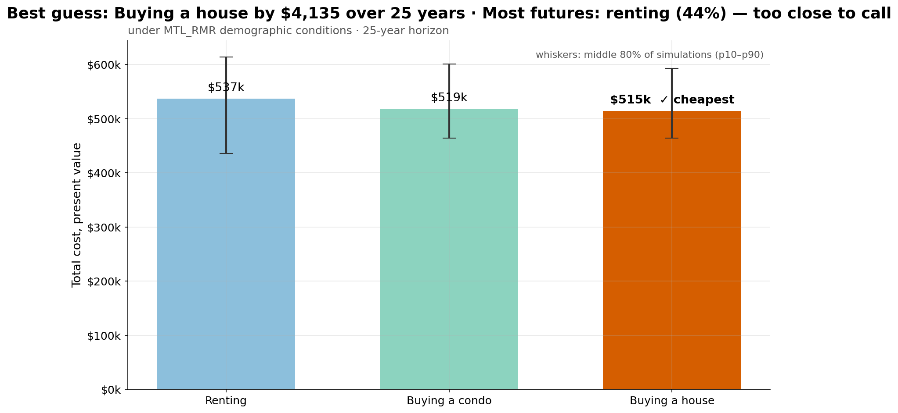
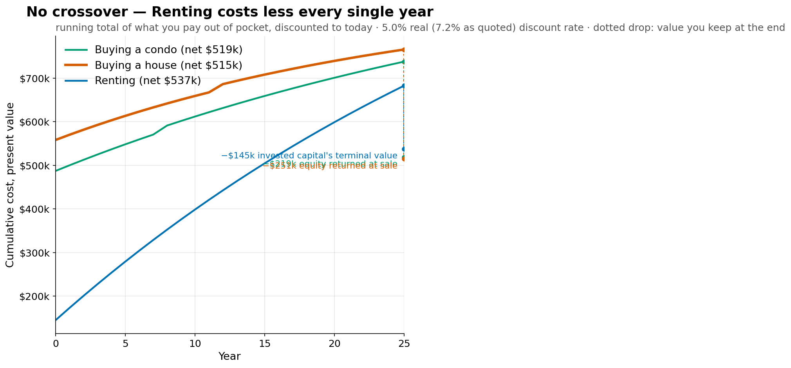
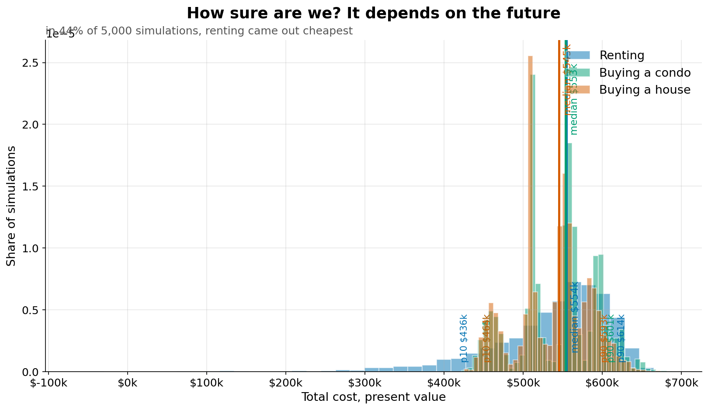
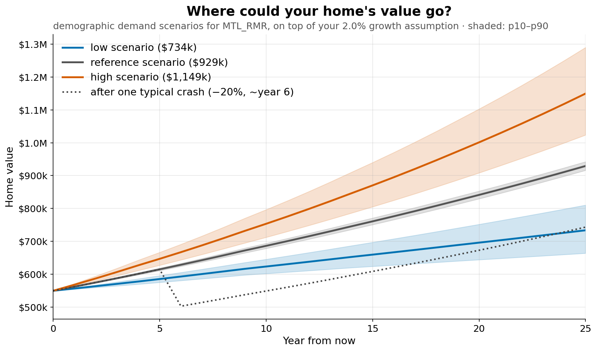
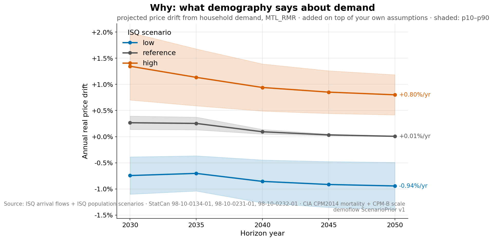
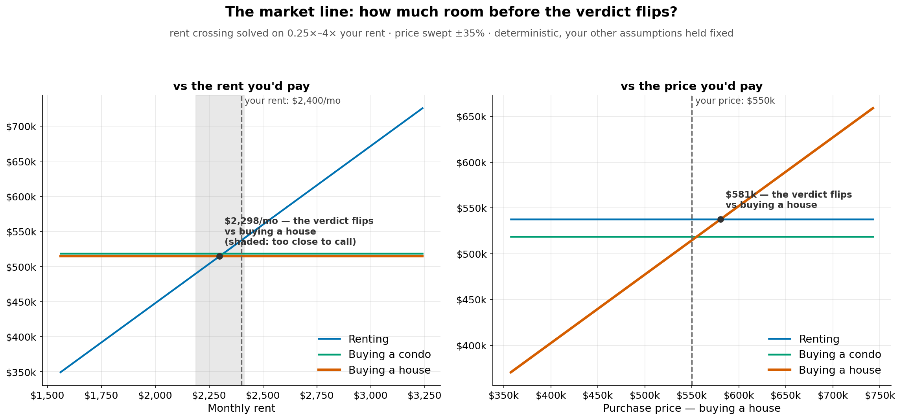

<!-- Regenerate with: uv run hde examples/showcase_demographic_prior.yaml --story docs/story (from the repo root) -->

# The story of this housing decision

**Too close to call — effectively a tie: Buying a house edges buying a condo by $3,115 (0.6%) over 25 years, cheapest in only 36% of 5,000 simulations — the Monte Carlo mean favours renting** — under MTL_RMR demographic conditions · 25-year horizon.

Demographic prior: MTL_RMR demand model (ISQ 2026 scenarios, 2021 census) · constants as of 2026-07-21 · simulation year 1 = calendar 2026, bands 2030/2035/2040/2045/2050 · mapping v1: excess-demand rate → real price drift through a linear-through-origin β prior with the uniform β demoflow pinned; horizon bands (2030…2050) are piecewise-constant with no interpolation; drawdown_weight_tilt multiplies the user's price-shock hazard (S4b sketch §1 slots 2–3, §3) · encoded REAL drift by band, added to value_growth_rate in the Monte Carlo — all: reference 2030 +0.27%/yr, 2035 +0.25%/yr, 2040 +0.09%/yr, 2045 +0.03%/yr, 2050 +0.01%/yr (scenarios -0.94%…+1.35%) · 13 pinned sources (sha256 in --json): StatCan 98-10-0231-01; ISQ arrival flows (RA); ISQ arrival flows (RMR); derived: headship rate by single year of age; StatCan 98-10-0232-01; derived: living-arrangement shares; StatCan 98-10-0134-01; CIA CPM2014 mortality + CPM-B scale; derived: ownership rate by geography × age; derived: HORS_RMR ownership curve; ISQ population scenarios (QC); ISQ population scenarios (RA); ISQ population scenarios (RMR).

## Act — The answer

Too close to call — effectively a tie: Buying a house edges buying a condo by $3,115 (0.6%) over 25 years, cheapest in only 36% of 5,000 simulations — the Monte Carlo mean favours renting

## Act — The race

Renting costs less out of pocket every single year — the ranking never flips (before the end-of-horizon equity credit, which decides the verdict).

## Act — The uncertainty

In 36% of 5,000 simulations, buying a house came out cheapest.

## Act — Your home's possible futures

Under MTL_RMR demographic demand scenarios, the home's value fans out around your 2.0% growth assumption.

## Act — Why

The demographic signal itself: projected price drift from household demand in MTL_RMR (ISQ 2026 scenarios, 2021 census).

## Act — The market line

Your $2,400/mo sits inside the tie band around the crossing — renting is cheaper below $2,193/mo; too close to call between $2,193/mo and $2,418/mo; buying a house is cheaper above $2,418/mo (crossing $2,303/mo; band = 5% of the cheaper option's PV).

Full text report: [report.txt](report.txt)

---

## Assumptions

- mode: real terms · discount_rate 5.0%
- condo: value growth +2.0%/yr · fee escalation +3.0%/yr · selling_cost_rate 5.0%
- house: value growth +2.0%/yr · maintenance 1.2% of value/yr · selling_cost_rate 5.0%
- condo other costs: property_tax $3,600/yr = 0.750% of price [no anchor match — hde --print-anchors]
- house other costs: property_tax $4,700/yr = 0.855% of price [no anchor match — hde --print-anchors] · home_insurance $1,200/yr [no anchor match — hde --print-anchors]
- rent: escalation +2.5%/yr · invested capital $145,000 at +5.0%/yr
- conventions: end-of-year cash flows discounted at (1+dr)^-t · fees, rent and other costs escalate before year 1, maintenance from year 1 · mortgage = level annual payment at an effective annual rate · $/mo equivalent at (1+dr)^(1/12)−1 (docs/reference/ARCHITECTURE.md figure glossary)
- demographic prior: MTL_RMR (ISQ 2026 scenarios, 2021 census) · constants as of 2026-07-21 · sha256 e73fff23ef46… [demoflow ScenarioPrior v1] · reference REAL drift over this 25-year run — all: +0.27%/yr (2030 band), +0.25%/yr (2035 band), +0.09%/yr (2040 band), +0.03%/yr (2045 band), +0.01%/yr (2050 band) (added to value_growth_rate in the Monte Carlo; all bands and the scenario range in --json)
- defaults applied: economic.mode='real', economic.inflation_rate=0.0% [ref: FP Canada 2026 PAG], condo.selling_cost_rate=5.0% [WOWA 2026], house.selling_cost_rate=5.0% [WOWA 2026]
